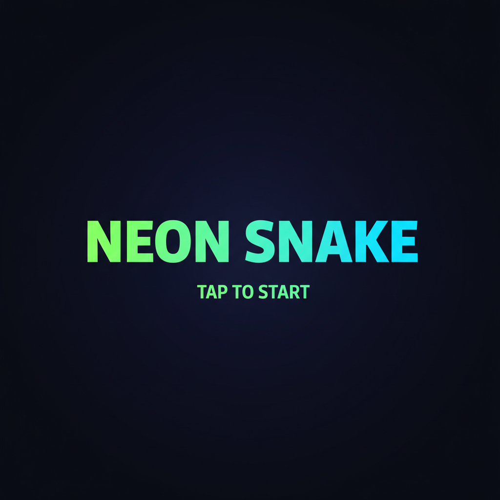
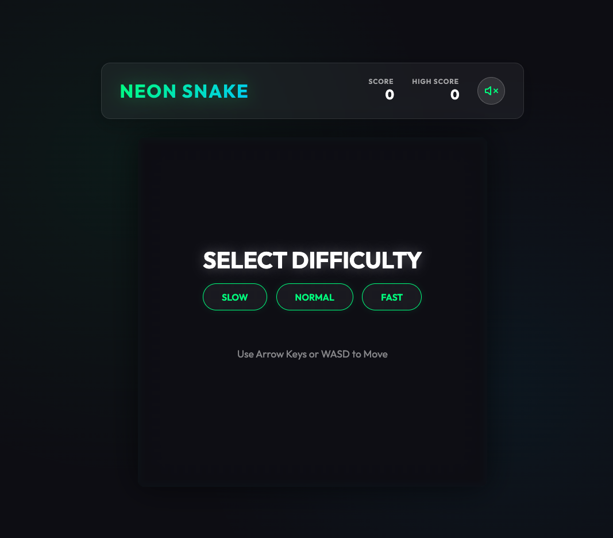

# Neon Snake Game 🐍✨

Ein modernes, visuell beeindruckendes Snake-Spiel im Cyberpunk-Neon-Stil. Entwickelt mit reinem HTML, CSS und JavaScript.

**[👉 JETZT KOSTENLOS ONLINE SPIELEN](https://mecodeup.github.io/Neon-Snake-Game/)**
*(Kein Login und kein Download erforderlich)*

| Start Screen | Gameplay |
|:---:|:---:|
|  |  |

## 🎮 Über das Spiel

Neon Snake bringt den Klassiker in die Moderne. Mit leuchtenden Neon-Effekten, einem dynamischen Synthesizer-Soundtrack und flüssigen Animationen bietet es ein erstklassiges Spielerlebnis auf Desktop und Mobilgeräten.

## ✨ Features

*   **Cyberpunk-Ästhetik:** Leuchtende Farben, Glassmorphismus-UI und sanfte Animationen.
*   **Dynamisches Audio:** Echtzeit-synthetisierte Soundeffekte und Hintergrundmusik über die Web Audio API (keine externen Dateien!).
*   **3 Schwierigkeitsstufen:**
    *   🐢 **Slow:** Für entspanntes Spielen.
    *   🐍 **Normal:** Die klassische Herausforderung.
    *   ⚡ **Fast:** Für Reflex-Profis.
*   **Highscore-System:** Dein bester Punktestand wird automatisch gespeichert.
*   **Mobile Support:** Optimierte Touch-Steuerung mit einem D-Pad für Smartphones und Tablets.
*   **Responsive Design:** Passt sich perfekt an jede Bildschirmgröße an.

## 🕹️ Steuerung

### Desktop
*   **Bewegen:** Pfeiltasten (`⬆️`, `⬇️`, `⬅️`, `➡️`) oder WASD (`W`, `A`, `S`, `D`).
*   **Starten:** Wähle eine Schwierigkeit im Menü.
*   **Mute:** Klicke auf das Lautsprecher-Symbol, um den Ton an/auszuschalten.

### Mobil
*   Nutze das **D-Pad** (Pfeiltasten) auf dem Bildschirm, um die Schlange zu steuern.
*   Tippe auf den Bildschirm, um das Spiel vom Splash-Screen aus zu starten.

## 🚀 Installation & Start

Es ist keine Installation notwendig! Das Spiel läuft direkt im Browser.

1.  Lade das Repository herunter oder klone es:
    ```bash
    git clone https://github.com/DeinUsername/Neon-Snake-Game.git
    ```
2.  Öffne die Datei `index.html` in einem modernen Webbrowser (Chrome, Firefox, Safari, Edge).

## 🛠️ Technologien

*   **HTML5:** Semantische Struktur.
*   **CSS3:** Vanilla CSS mit CSS Variables, Flexbox und Animationen.
*   **JavaScript (ES6+):** Spiellogik, Canvas-Rendering und Audio-Synthese.

---
*Entwickelt mit Google Antigravity* 2025
